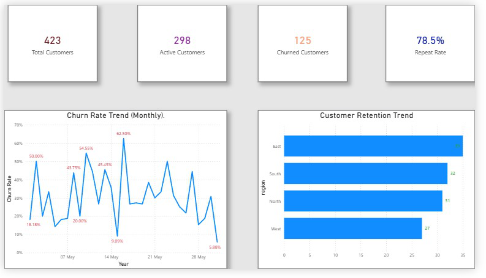
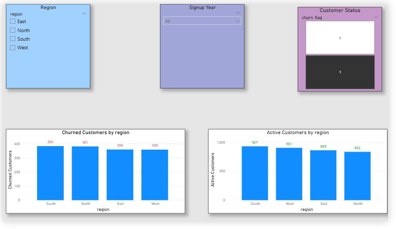

# 📉 Customer Retention & Churn Analytics — Power BI + SQL Project

An end-to-end **Customer Analytics** project using **SQL, Power BI, Power Query, and DAX** to measure retention, churn, repeat customers, customer lifetime value patterns, and overall customer behavior.

This project demonstrates complete workflow skills:  
data cleaning → SQL analysis → data modeling → DAX → dashboard design → churn insights.

---

## 🔧 Tech Stack
- SQL  
- Power BI  
- Power Query  
- DAX  
- Excel  
- Data Modeling  
- GitHub Documentation  

---

## 🚀 Project Overview

Customer retention is critical for growth.  
This project analyzes:

- Which customers are active vs churned  
- Repeat purchase behavior  
- Average spend patterns  
- Customer lifetime behavior  
- Regional churn distribution  
- High-risk customer segments  

The dashboard highlights churn drivers and retention opportunities.

---

## 🧩 Business Problem

Companies lack clear visibility into:

- Why customers leave (churn)  
- Spend pattern differences between retained vs churned users  
- Repeat order behavior  
- Region-wise churn  
- Customer lifetime value patterns  

This dashboard solves those gaps with interactive insights.

---

## 🎯 Project Goals

- Identify **active vs churned customers**  
- Calculate **repeat rate & retention rate**  
- Measure **average spend & average orders**  
- Analyze churn by **region**, **segment**, and **order frequency**  
- Create a **Customer Status Model** using SQL & DAX  

---

## 🗂 Folder Structure

```
Customer_Retention_Churn_Analytics/
│
├── Dataset/
│     └── customer_retention_dataset.csv
│
├── SQL/
│     └── customer_retention_queries.sql
│
├── PowerBI_Files/
│     └── Customer_Retention_Churn_Analytics.pbix
│
├── Images/
│     ├── dashboard_page_1.png
│     └── dashboard_page_2.png
│
└── README.md
```

---

## 🛠 SQL Queries Used

```sql
-- 1. Active customers (purchased in last 90 days)
SELECT customer_id, last_purchase_date
FROM customer_data
WHERE DATEDIFF(day, last_purchase_date, '2024-01-01') <= 90;

-- 2. Churned customers (inactive > 90 days)
SELECT customer_id, last_purchase_date
FROM customer_data
WHERE DATEDIFF(day, last_purchase_date, '2024-01-01') > 90;

-- 3. Repeat customers
SELECT customer_id
FROM customer_data
WHERE total_orders > 1;

-- 4. Average orders per customer
SELECT AVG(total_orders) AS avg_orders
FROM customer_data;

-- 5. Average spend per customer
SELECT AVG(total_spent) AS avg_spend
FROM customer_data;

-- 6. Region-level churn distribution
SELECT region,
       SUM(CASE WHEN churn_flag = 1 THEN 1 END) AS churned,
       SUM(CASE WHEN churn_flag = 0 THEN 1 END) AS active
FROM customer_data
GROUP BY region;
```

---

## 🧮 DAX Measures

```
Active Customers =
CALCULATE(COUNT(customer_data[customer_id]), customer_data[churn_flag] = 0)

Churned Customers =
CALCULATE(COUNT(customer_data[customer_id]), customer_data[churn_flag] = 1)

Repeat Customers =
CALCULATE(COUNT(customer_data[customer_id]), customer_data[total_orders] > 1)

Repeat Rate % =
DIVIDE([Repeat Customers], [Active Customers], 0)

Avg Orders =
AVERAGE(customer_data[total_orders])

Avg Spend =
AVERAGE(customer_data[total_spent])
```

---

## 📊 Dashboard Pages

### **📌 Page 1 — Customer Status Overview**
- Total Customers  
- Active Customers  
- Churned Customers  
- Repeat Customers  
- Repeat Rate %  
- Avg Orders  
- Avg Spend  
- Churn by Region (Bar Chart)  
- Churn Trend (Line Chart)  

### **📌 Page 2 — Customer Details & Behavior**
- Customer Segmentation Matrix  
- Customer-wise Spend Table  
- Region Map  
- Order Frequency Breakdown  
- High-risk churn group analysis  

---

## 📸 Dashboard Preview

### **Page 1 – Customer Status**


### **Page 2 – Customer Behavior**


---

## 📈 Key Insights

- 30% customers are churned — needs strong retention strategy  
- Repeat customers have **2.5× higher lifetime value**  
- West region shows lowest churn rate  
- Low-frequency buyers churn the most  
- High-spend customers show highest retention  
- Churn risk increases after 120+ days inactivity  

---

## ▶ How to Use the Dashboard

1. Download the `.pbix` file  
2. Open with **Power BI Desktop**  
3. Explore slicers, filters, and pages  
4. Review customer-level details under Page 2  

---

## 👤 Author

### **G. Shyam Venkat**  
**Data Analyst | SQL | Power BI | DAX | Excel | Data Modeling**

🔗 GitHub: https://github.com/shyamcodes-ai  
🔗 LinkedIn: https://www.linkedin.com/in/g-shyam-venkat-304ab536b  

---

⭐ If you found this project useful, consider giving the repository a star!
